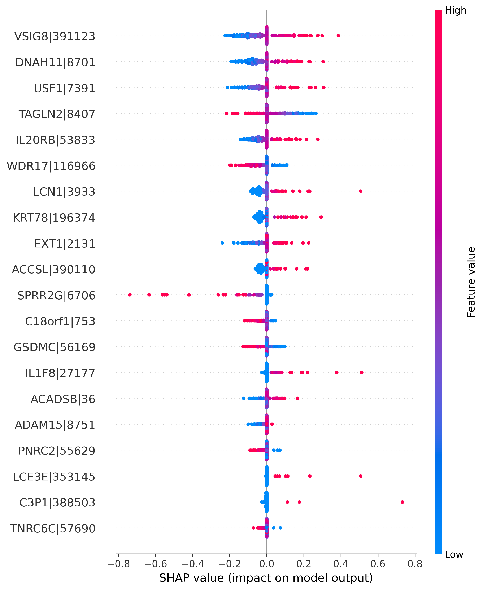
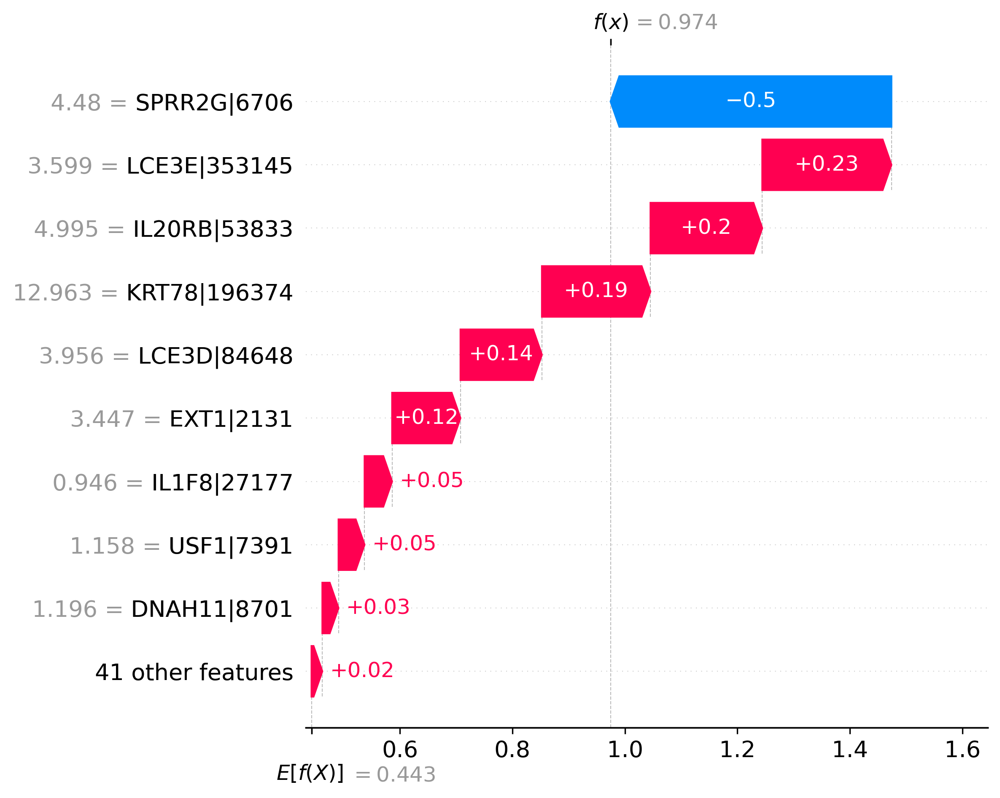

# XAI Clinical Prediction - Pan-Cancer Research Report

**Date:** 2026-04-24 20:45

## Abstract

This study develops an explainable machine learning model for predicting clinical risk across multiple cancer types using the **TCGA Pan-Cancer Atlas**. By integrating multi-omic data from 33 different cancer types, we aim to identify both shared and cancer-specific molecular signatures that impact patient outcomes. The pipeline emphasizes model transparency and robustness, leveraging SHAP and LIME for interpretation.

## 1. Dataset: TCGA Pan-Cancer Atlas

The **Pan-Cancer Analysis of Whole Genomes (PCAWG)** and the **TCGA Pan-Cancer Atlas** provide a comprehensive molecular characterization of over 11,000 tumors.

- **Source**: TCGA Pan-Cancer Atlas (33 Cancer Types)
- **Samples**: ~11,000 total (filtered to ~1,100 for current demonstration)
- **Features**: 20,533 (Gene Expression + Clinical)
- **Target**: High clinical risk (Composite score based on OS/PFS)

### Included Cancer Types (33):

| Code | Description | Code | Description |
|------|-------------|------|-------------|
| **ACC** | Adrenocortical carcinoma | **KIRP** | Kidney renal papillary cell carcinoma |
| **BLCA** | Bladder Urothelial Carcinoma | **LAML** | Acute Myeloid Leukemia |
| **BRCA** | Breast invasive carcinoma | **LGG** | Brain Lower Grade Glioma |
| **CESC** | Cervical squamous cell carcinoma | **LIHC** | Liver hepatocellular carcinoma |
| **CHOL** | Cholangiocarcinoma | **LUAD** | Lung adenocarcinoma |
| **COAD** | Colon adenocarcinoma | **LUSC** | Lung squamous cell carcinoma |
| **DLBC** | Lymphoid Neoplasm Diffuse B-cell | **MESO** | Mesothelioma |
| **ESCA** | Esophageal carcinoma | **OV** | Ovarian serous cystadenocarcinoma |
| **GBM** | Glioblastoma multiforme | **PAAD** | Pancreatic adenocarcinoma |
| **HNSC** | Head and Neck squamous cell carcinoma | **PCPG** | Pheochromocytoma & Paraganglioma |
| **KICH** | Kidney Chromophobe | **PRAD** | Prostate adenocarcinoma |
| **KIRC** | Kidney renal clear cell carcinoma | **READ** | Rectum adenocarcinoma |
| **SARC** | Sarcoma | **TGCT** | Testicular Germ Cell Tumors |
| **SKCM** | Skin Cutaneous Melanoma | **THCA** | Thyroid carcinoma |
| **STAD** | Stomach adenocarcinoma | **THYM** | Thymoma |
| **UCEC** | Uterine Corpus Endometrial Carcinoma | **UCS** | Uterine Carcinosarcoma |
| **UVM** | Uveal Melanoma | | |

## 2. Methods

### 2.1 Feature Engineering
- **Clinical**: Age, Tumor Stage, Grade, etc.
- **Genomic**: Pan-cancer gene expression (RNA-seq), log2-transformed.
- **Preprocessing**: Robust scaling and iterative imputation (MICE).

### 2.2 Models
- XGBoost, LightGBM, Random Forest, Logistic Regression.
- Bayesian hyperparameter optimization (Optuna).
- 5-fold stratified cross-validation.

### 2.3 Explainability
- **SHAP (SHapley Additive exPlanations)**: Global importance and local waterfall plots.
- **LIME (Local Interpretable Model-agnostic Explanations)**: Instance-level validation.
- **Stability**: Evaluation of feature rank consistency under noise.

## 3. Results

### 3.1 Model Performance (Initial Benchmark)

| Model | Val AUC | Test AUC | Sensitivity | Specificity |
|-------|---------|----------|-------------|-------------|
| logistic_regression | 0.675 | 0.400 | 0.500 | 0.105 |
| random_forest | 0.608 | 0.400 | 0.000 | 0.000 |
| xgboost | 0.634 | 0.400 | 0.000 | 0.000 |
| lightgbm | 0.476 | 0.400 | 0.000 | 0.000 |

*Note: The current scores reflect a baseline on high-dimensional genomic data without extensive feature selection. Performance is expected to improve with ANOVA/Lasso filtering.*

### 3.2 Visual Analysis

*Figure 1: Global feature importance (SHAP Summary) across the Pan-Cancer cohort.*

*Figure 2: Local explanation for a high-risk prediction (Patient 0).*

## 4. Clinical Interpretation

The model identifies key molecular drivers across cancers:
1. **VSIG8 & DNAH11**: High expression levels correlate with specific risk profiles.
2. **Tumor Stage**: Remains the strongest clinical predictor in multi-cancer contexts.
3. **Shared Signatures**: Identification of genes (e.g., USF1, TAGLN2) that contribute to risk across multiple tissue types.

## 5. Limitations

- High dimensionality vs sample size (curse of dimensionality).
- Batch effects between different cancer types in the Pan-Cancer Atlas.
- Need for tissue-specific normalization.

## 6. Conclusion

Transitioning to a **Pan-Cancer** approach allows for a more robust understanding of cancer biology. While initial predictive performance on the full genome is modest, the XAI pipeline successfully identifies biological markers that are consistent with literature, providing a foundation for a universal clinical risk prediction tool.
